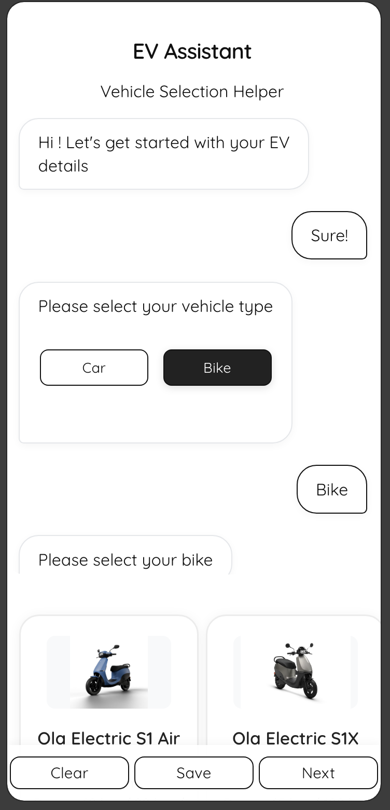
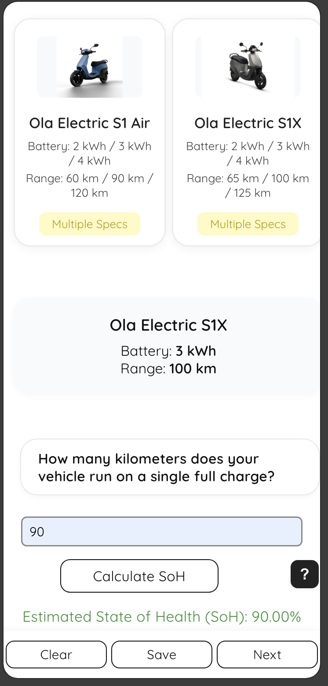
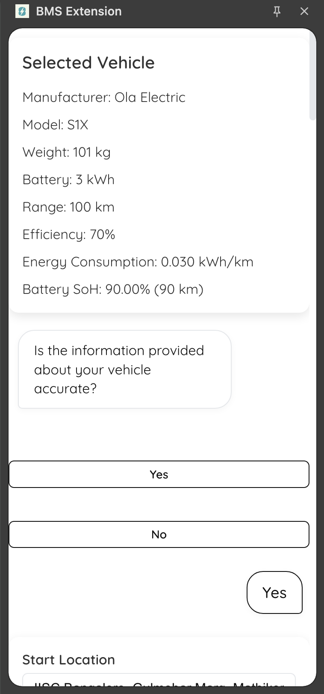
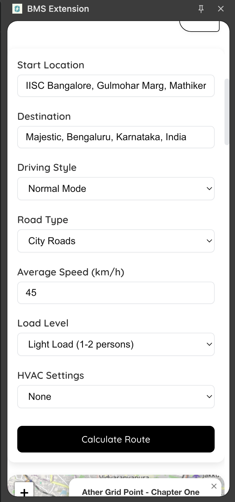
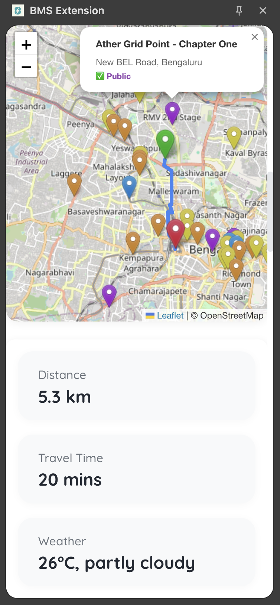
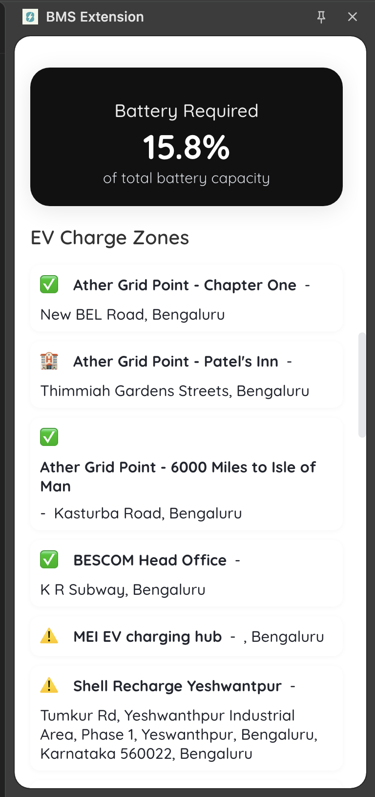

# BMS Browser Extension

A Chrome extension for Electric Vehicle (EV) battery percentage estimation, route planning, and charging station discovery.
This extension provides real-time battery status, energy estimation, and optimized route planning using multiple data sources.

## 📝 Summary

The BMS Browser Extension helps EV users:

- ⚡ **Estimate battery percentage in real-time** under varying external conditions
- 🗺 **Plan energy-efficient routes** with charging station suggestions
- 🔌 **Discover and categorize nearby or en-route EV charging stations**
- 🔮 **Estimate energy consumption and driving range** based on traffic, elevation, and weather

It integrates with Google Maps, Weatherstack, TomTom, and Open Charge Map APIs to enhance the EV driving experience directly from your browser.

## ⚙️ How It Works

- Load as an unpacked extension in Chrome
- Provides a popup interface and interactive map for user operations
- Injects scripts into web pages for real-time interaction
- Uses APIs for route planning, traffic, weather, and charging stations
- Optional Python backend for advanced analytics and modular expansion

## 📁 Project Structure

```text
BMS-Browser-Extension/
│
├── manifest.json       # Extension configuration
├── background.js       # Background service worker
├── content.js          # Content script for page interaction
│
├── popup.html          # Popup interface
├── popup.js
├── popup.css
│
├── icons/              # Extension icons
├── map/                # Route planning & charging station map
├── estimate/           # Energy & range estimation tool
├── backend/            # Optional Python backend
└── screenshots/        # Extension screenshots
```

## ✨ Features

### Battery Estimation System (BES)
- Monitor State of Health (SoH), battery efficiency, and energy consumption
- Simulate basic EV battery control functions

### 🗺 Route Planning
- Generate optimized routes considering traffic, elevation, and weather
- Integrates charging station locations along the route

### ⚡ Charging Station Discovery
- Discover nearby and en-route stations using Open Charge Map
- Categorize stations as Public, Guest-only, Showroom, or Unverified

### 🔮 Energy & Range Estimation
- Estimate trip energy consumption and driving range
- Adjust predictions for HVAC usage, terrain, and traffic conditions

### 🧩 Modular & Scalable Architecture
- Clean, structured codebase with separate modules for popup UI, maps, and estimation
- Easily extensible for new features or additional EV datasets

## 🚀 Installation

### 1️⃣ Clone Repository

```bash
git clone https://github.com/Syvoltorg/EV-Battery-Estimation-System-Extension.git
cd EV-Battery-Estimation-System-Extension
```

### 2️⃣ Install Dependencies

```bash
npm install
```

### 3️⃣ Build Project

```bash
npm run build
```
**(This will automatically create the node_modules folder and install all the required dependencies listed in package.json.)**

### 4️⃣ Load in Chrome

1. Open `chrome://extensions/`
2. Enable Developer Mode
3. Click "Load Unpacked"
4. Select the project folder

## 🔐 API Keys

Some features, such as maps, weather data, traffic, and charging station discovery, require API keys.

- **Local Storage:** Keys are stored in `map/apikeys.js`

### Security
- Do not commit keys to public repositories
- Add `map/apikeys.js` to `.gitignore`
- Optionally move keys to backend for extra security

### API Key Details & Limits

| API Service        | Purpose                    | Free Limit                        |
|--------------------|----------------------------|-----------------------------------|
| Google Maps API    | Maps, routing, traffic     | $200 free/month (requires billing) |
| WeatherStack API   | Weather & temperature data | 250 requests/month                |
| TomTom API         | Traffic & routing          | 2,500 requests/day                |
| Open Charge Map    | EV charging stations       | Free for open-source projects      |

## 📸 Screenshots

Preview of the EV Battery Estimation System (BMS Extension) side panel:

<p align="center">
  
  
  
  
  
  
</p>

**Screenshot Flow:**

1. Intro – Clean and minimal starting interface
2. Selected Vehicle and SoH – Choose your EV for energy estimation
3. Vehicle Details – Battery specs, SoH, and weight for accurate calculations
4. Location Input – Enter start and destination for route planning
5. Map – Optimized route with traffic, weather, and nearby charging stations
6. Charging Stations – Categorized as Public, Guest-only, Showroom, or Unverified

## 🙌 Contributing
Feel free to submit pull requests or open issues for any bugs or feature requests. If you add new APIs or update architecture, make sure to update the documentation too.

## 📜 License

This project is licensed under the GPL v3 License.
See the [LICENSE](LICENSE) file for full details.
